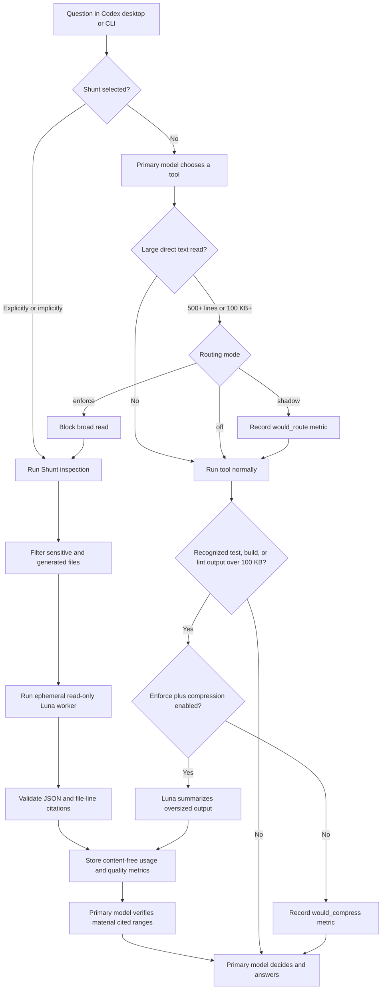

# Codex Shunt

Codex Shunt is a local Codex plugin that keeps judgment-heavy work in the
primary model while routing large, predictable repository analysis to a
subscription-authenticated GPT-5.6 Luna worker. It records content-free local
telemetry so you can measure how often routing happens, the worker tokens and
credits consumed, estimated primary-context avoided, latency, citation quality,
and fallback behavior.

Codex Shunt uses `codex exec`, not the OpenAI API. It removes `CODEX_API_KEY` and
`OPENAI_API_KEY` from the worker environment and, by default, refuses to run a
worker unless `codex login status` reports ChatGPT authentication.

## Quick start

After installing the plugin and trusting its hooks, install the `shunt` command
into your user-local command directory:

```bash
"$HOME/plugins/codex-shunt/scripts/install-command"
```

The installer creates `~/.local/bin/shunt` without changing shell startup
files. If `~/.local/bin` is not already on `PATH`, add it to your shell profile
and open a new shell:

```bash
printf '%s\n' 'export PATH="$HOME/.local/bin:$PATH"' >> "$HOME/.zprofile"
export PATH="$HOME/.local/bin:$PATH"
```

Then verify the setup and begin in observation-only mode:

```bash
shunt doctor
shunt config set mode shadow
shunt stats --since 1h
```

After the verification steps in this README pass, enable automatic routing:

```bash
shunt config set mode enforce
```

## Current scope

Version 0.1.0 implements:

- a packaged Codex skill and `PreToolUse` / `PostToolUse` hooks;
- safe `off`, `shadow`, and `enforce` routing modes;
- an isolated read-only GPT-5.6 Luna worker;
- explicit repository inspection and log summarization commands;
- SQLite telemetry with stats, JSON, CSV, and HTML reporting;
- citation validation, sensitive-file filtering, size limits, and bypasses;
- local unit and hook-integration tests.

It does **not** automatically delegate code writing. Architecture, security,
ambiguous debugging, migrations, destructive work, and final review stay with
the primary model.

## How it works



1. The primary Codex model receives the user request.
2. The plugin's `PreToolUse` hook inspects large direct reads. In `shadow` mode
   it records what it would route. In `enforce` mode it blocks a qualifying read
   and tells the primary model to invoke the bundled Shunt skill.
3. The Shunt runner resolves approved text files, excludes common sensitive and
   generated paths, and copies the selected files into an isolated temporary
   workspace.
4. A fresh `codex exec --json --ephemeral --skip-git-repo-check` process runs
   GPT-5.6 Luna with a read-only sandbox and a strict JSON output schema. The
   skip flag is required because the isolated temporary workspace is
   intentionally not a Git checkout.
5. Codex Shunt validates returned file paths and line ranges, stores token usage
   and quality telemetry, and gives the compact result to the primary model.
6. The primary model rereads only material cited ranges and owns the final
   decision, edit, and verification.

The worker process disables hooks and sets `CODEX_SHUNT_WORKER=1`, preventing
recursive routing.

`PostToolUse` can also detect oversized test, build, lint, and compiler output.
Compression is disabled by default. When explicitly enabled in `enforce` mode,
the hook sends the output to Luna and replaces the original model-visible result
with a concise, cited failure summary.

## Where it works

| Surface | Behavior |
| --- | --- |
| Codex local task in the ChatGPT desktop app | Skill and trusted hooks can run automatically |
| Codex CLI | Skill and trusted hooks can run automatically |
| Ordinary Terminal command | Hooks do not run; use `shunt` directly |
| Codex cloud task | Cannot run this Mac-local script or inspect the local repository |
| Regular ChatGPT web conversation | Cannot run the local worker |

Start a new Codex task after installing or updating the plugin so the current
skill and hooks are loaded.

## Requirements

- A Codex executable available on `PATH`, installed at `~/.local/bin/codex`,
  or bundled with the Codex/ChatGPT desktop app
- Python 3.11 or newer
- A ChatGPT plan with Codex and GPT-5.6 Luna access
- Local filesystem access to the repository being inspected

The implementation uses only the Python standard library. It has no package
manager or API SDK dependency.

## Authentication

Codex Shunt finds the executable in this order:

1. `CODEX_SHUNT_CODEX_PATH`, when set
2. `codex` on `PATH`
3. `~/.local/bin/codex`
4. the standard system or per-user Codex/ChatGPT desktop app bundle

This means the plugin can normally reuse the Codex executable and ChatGPT login
bundled with the desktop app even when `codex` is not a terminal command.

Check your current Codex authentication:

```bash
codex login status
```

If `codex` is not on `PATH`, run the bundled executable directly. For the
current ChatGPT desktop app installation, for example:

```bash
/Applications/ChatGPT.app/Contents/Resources/codex login status
```

The expected result contains:

```text
Logged in using ChatGPT
```

If needed, authenticate interactively:

```bash
codex login
```

Or, when `codex` is not on `PATH`:

```bash
"/Applications/ChatGPT.app/Contents/Resources/codex" login
```

Then run:

```bash
shunt doctor
```

For a nonstandard installation, pin the executable explicitly:

```bash
export CODEX_SHUNT_CODEX_PATH="/absolute/path/to/codex"
shunt doctor
```

Codex Shunt deliberately requires ChatGPT authentication so worker runs use the
Codex subscription allowance rather than API billing. An advanced local test can
set `CODEX_SHUNT_REQUIRE_CHATGPT_AUTH=0`, but that removes the subscription-only
guard and is not recommended for ordinary use.

## Install from the personal marketplace

This development copy is registered in the default personal marketplace at:

```text
$HOME/.agents/plugins/marketplace.json
```

Install it with:

```bash
codex plugin add codex-shunt@personal
```

If `codex` is not on `PATH`, use the desktop-bundled executable:

```bash
"/Applications/ChatGPT.app/Contents/Resources/codex" \
  plugin add codex-shunt@personal
```

Review the plugin's hook definition when Codex asks whether to trust it. Plugin
installation does not automatically trust hook scripts. Start a **new Codex
task** after installation so the new skill and hooks are loaded.

To review hook trust explicitly, launch the Codex CLI and enter `/hooks`:

```bash
"/Applications/ChatGPT.app/Contents/Resources/codex"
```

Confirm that the Codex Shunt `PreToolUse` and `PostToolUse` hooks are enabled
and trusted. Codex requires another review whenever a hook definition changes.

## Install the `shunt` command

The documented command name is `shunt`. The installer creates a symlink in
`~/.local/bin`, so the command works in shells, scripts, and other tools that
use `PATH`:

```bash
"$HOME/plugins/codex-shunt/scripts/install-command"
command -v shunt
shunt --version
```

Set `CODEX_SHUNT_BIN_DIR` to install somewhere other than `~/.local/bin`:

```bash
CODEX_SHUNT_BIN_DIR="$HOME/bin" \
  "$HOME/plugins/codex-shunt/scripts/install-command"
```

To upgrade the command after changing or updating the source, rerun the
installer. To remove only the symlink managed by this checkout:

```bash
"$HOME/plugins/codex-shunt/scripts/install-command" --uninstall
```

To reinstall after changing the source, use the plugin-creator cachebuster flow:

```bash
python3 "$HOME/.codex/skills/.system/plugin-creator/scripts/update_plugin_cachebuster.py" \
  "$HOME/plugins/codex-shunt"
"/Applications/ChatGPT.app/Contents/Resources/codex" \
  plugin add codex-shunt@personal
```

## When routing triggers

Codex can enter Shunt through three paths.

### Implicit skill selection

Codex may select Shunt automatically when a request matches its skill
description. Strong matches include repository-wide inventories, extracting or
classifying many call sites, summarizing large files or directories, log
triage, and Shunt metrics. Implicit selection is model-driven and is not
guaranteed.

### Explicit skill or command

Use explicit routing when you need deterministic worker execution. Ask Codex:

```text
Use Codex Shunt to inventory every authenticated client construction and
classify its credential source. Verify the material citations afterward.
```

You can also run `shunt inspect` directly.

### Automatic hook routing

The `PreToolUse` hook examines text-file reads initiated by Codex through
supported shell and MCP tools. A read qualifies when the selected files total
at least `min_file_lines` (500 by default) or `min_source_bytes` (100000 bytes
by default).

The `PostToolUse` hook watches recognized test, build, lint, type-check, and
compiler commands. Output qualifies at `post_tool_min_bytes` (100000 bytes by
default). Compression occurs only when `mode` is `enforce` and
`post_tool_compression` is `true`.

Hooks observe tools called by Codex in the desktop app or CLI. Commands you run
manually in an ordinary Terminal do not trigger the hooks.

## Modes

Show the active configuration:

```bash
shunt config show
```

The default mode is `shadow`:

```bash
shunt config set mode shadow
```

In shadow mode, hooks never block or replace output. They only record qualifying
operations.

Enable routing enforcement:

```bash
shunt config set mode enforce
```

Disable all routing hooks while leaving the plugin installed:

```bash
shunt config set mode off
```

To bypass an enforced routing decision once, prefix the original command:

```bash
CODEX_SHUNT_BYPASS=1 sed -n '1,1200p' path/to/large-file.ts
```

| Mode | Behavior | When to use it |
| --- | --- | --- |
| `off` | Hooks do nothing | Emergency disable or hook troubleshooting |
| `shadow` | Records `would_route` or `would_compress`; original result continues | Initial rollout and threshold tuning |
| `enforce` | Blocks qualifying large reads and can replace oversized output with a Luna summary | Normal automatic operation after verification |

## Configuration reference

Use `shunt config set KEY VALUE`. Settings are written to
`$HOME/.local/share/codex-shunt/config.toml`.

| Key | Default | When and why to change it | Example |
| --- | --- | --- | --- |
| `mode` | `shadow` | Use `enforce` after verification; `off` disables hooks | `shunt config set mode enforce` |
| `worker_model` | `gpt-5.6-luna` | Keep Luna for low-credit bulk work; change only for controlled comparisons | `shunt config set worker_model gpt-5.6-terra` |
| `reasoning_effort` | `low` | Raise for harder classification, accepting more latency and usage | `shunt config set reasoning_effort medium` |
| `min_file_lines` | `500` | Raise to route fewer reads; lower to route more | `shunt config set min_file_lines 800` |
| `min_source_bytes` | `100000` | Adjust the byte-size alternative to the line threshold | `shunt config set min_source_bytes 200000` |
| `max_source_files` | `500` | Cap how many approved files one worker receives | `shunt config set max_source_files 250` |
| `max_source_bytes` | `10000000` | Cap copied source and oversized-output input | `shunt config set max_source_bytes 5000000` |
| `max_output_chars` | `12000` | Bound the structured worker result returned to the parent | `shunt config set max_output_chars 8000` |
| `post_tool_compression` | `false` | Enable only with `enforce` after testing log summaries | `shunt config set post_tool_compression true` |
| `post_tool_min_bytes` | `100000` | Raise when ordinary test output is compressed too often | `shunt config set post_tool_min_bytes 200000` |
| `worker_timeout_seconds` | `150` | Raise for unusually large inspections; lower for faster failure | `shunt config set worker_timeout_seconds 240` |
| `retain_raw_worker_events` | `false` | Reserved; current versions do not retain raw events | `shunt config set retain_raw_worker_events false` |

Restore the recommended conservative configuration:

```bash
shunt config set mode shadow
shunt config set worker_model gpt-5.6-luna
shunt config set reasoning_effort low
shunt config set min_file_lines 500
shunt config set min_source_bytes 100000
shunt config set post_tool_compression false
```

## Command summary

| Command | When to use it | What it does |
| --- | --- | --- |
| `shunt doctor [--json]` | Installation and troubleshooting | Checks Python, Codex discovery, ChatGPT auth, plugin files, storage, and config |
| `shunt config show` | Before testing or tuning | Prints the effective configuration |
| `shunt config set KEY VALUE` | Changing routing behavior | Writes one validated user setting |
| `shunt inspect ...` | Predictable repository-wide evidence collection | Sends approved files to a read-only Luna worker |
| `shunt summarize-log ...` | Large or repetitive test/build logs | Groups failures and cites useful line ranges |
| `shunt stats --since TIME` | Quick operational check | Shows routing, usage, quality, and savings estimates |
| `shunt report --since TIME` | Reviewing trends visually | Generates a self-contained HTML report |
| `shunt export ...` | External analysis or backup | Exports content-free telemetry as JSON or CSV |
| `shunt feedback RUN_ID VERDICT` | Evaluating worker quality | Records accepted or rejected feedback |
| `shunt data-dir` | Finding configuration and metrics | Prints the active data directory |
| `shunt --version` | Checking the command | Prints the Shunt version |

## Commands

### Check setup

```bash
shunt doctor
shunt doctor --json
```

### Inspect files or directories with Luna

```bash
shunt inspect \
  --root "$(git rev-parse --show-toplevel)" \
  --question "Find every authenticated client construction and classify its credential source" \
  src tests
```

Machine-readable output:

```bash
shunt inspect \
  --root "$(git rev-parse --show-toplevel)" \
  --question "Catalogue background jobs, triggers, retries, and tables touched" \
  --json \
  src/jobs
```

### Summarize a large test or build log

```bash
shunt summarize-log \
  --root "$(pwd)" \
  test-output.log
```

An optional `--question` can ask for a specific form of triage.

### Show metrics

```bash
shunt stats --since 24h
shunt stats --since 7d
shunt stats --since all --json
```

`--since` accepts `all`, `<N>h`, `<N>d`, or an ISO timestamp.

The terminal view leads with estimated credits saved, estimated primary-model
context avoided by enforced routing, worker success, and citation validity.
Supporting activity and per-model usage follow underneath. Color is enabled
automatically for an interactive terminal and omitted when output is
redirected. Use `--color always` or `--color never` to override detection; the
standard `NO_COLOR` environment variable also disables automatic color.

```text
Codex Shunt  ·  all time

CREDITS SAVED      7.9042 credits     estimated · 94.8% less than Sol-equivalent
CONTEXT AVOIDED    0 tokens           no intercepted context
SUCCESS RATE       66.7%              2 of 3 worker runs
CITATION VALIDITY  100.0%             4 of 4 citations valid

Activity
Runs         3 total · 2 succeeded · 1 failed · 1 escalation
Routing      No eligible operations observed
Usage        154,823 input · 94,976 cached · 2,801 output
Worker cost  0.4308 credits exact · 8.3350 Sol-equivalent estimated
Latency      22.17s average
```

### Generate an HTML report

```bash
shunt report --since 30d
```

The default report is written under the data directory. Choose another path:

```bash
shunt report \
  --since all \
  --output ./codex-shunt-report.html
```

### Export metrics

```bash
shunt export \
  --since all \
  --format json \
  --output ./codex-shunt-metrics.json

shunt export \
  --since 30d \
  --format csv \
  --output ./codex-shunt-metrics.csv
```

### Record human feedback

Every worker result prints a run ID. Mark whether it was useful:

```bash
shunt feedback RUN_ID accepted
shunt feedback RUN_ID rejected \
  --note "Missed the dynamically registered handler"
```

### Print the data directory

```bash
shunt data-dir
```

The default is:

```text
$HOME/.local/share/codex-shunt
```

Override it for a command, project, or test:

```bash
CODEX_SHUNT_DATA_DIR=/path/to/data \
  shunt stats --since all
```

## Metrics and interpretation

Codex Shunt stores:

- routing decisions and reasons;
- parent-model identity supplied by hooks;
- selected file, byte, and line counts;
- estimated source tokens intercepted, calculated as bytes divided by four;
- exact worker input, cached-input, output, and reasoning token counts;
- exact worker credits using the bundled GPT-5.6 Luna rate snapshot;
- an estimated Sol-equivalent counterfactual for the same worker tokens;
- duration, status, worker escalation, and citation-validation counts;
- optional accepted/rejected feedback.

It does not store prompts, repository paths, file names, source code, raw command
output, or worker answers in SQLite. Questions and repository roots are stored
only as short SHA-256 hashes.

The following values are exact:

- Luna token usage returned by `codex exec --json`
- worker model and worker credits
- run count, status, latency, and citations validated

The following values are estimates:

- source tokens prevented from entering the primary context
- Sol-equivalent worker credits
- worker-stage credit difference
- total subscription capacity saved

Shadow-mode candidates are reported as identified context, not avoided context;
only enforced routing and compression contribute to the avoided-context total.

Current Codex hooks expose the primary model name but not stable primary-turn
token totals. Therefore this version cannot honestly report an exact percentage
of all high-tier versus low-tier tokens. It reports exact worker usage and
estimated high-tier context avoided without mixing their labels.

The bundled rate snapshot is:

| Model | Input / 1M | Cached input / 1M | Output / 1M |
| --- | ---: | ---: | ---: |
| GPT-5.6 Luna | 5 credits | 0.5 credits | 30 credits |
| GPT-5.6 Sol counterfactual | 100 credits | 10 credits | 500 credits |

Update `LUNA_RATES` and `SOL_RATES` in `src/codex_shunt/worker.py` if the
published subscription rate card changes.

## Post-tool output compression

Output compression requires both `enforce` mode and the feature flag:

```bash
shunt config set mode enforce
shunt config set post_tool_compression true
```

Only recognized test, build, lint, type-check, and compiler commands over the
configured byte threshold qualify. Disable it independently with:

```bash
shunt config set post_tool_compression false
```

Because the hook receives output only after the command finishes, it cannot undo
command side effects. It only controls what reaches the model. When output is
larger than `max_source_bytes`, the worker receives the beginning and end with a
clear truncation marker instead of an unbounded payload.

## Safety boundaries

The source collector:

- rejects paths outside `--root`;
- rejects explicitly requested `.env`, private-key, credential, keystore, and
  provisioning-profile files;
- skips common generated or dependency directories;
- skips binary files;
- caps file count and aggregate source bytes;
- copies approved source into a temporary workspace;
- runs Luna with a read-only sandbox;
- validates returned citations locally;
- deletes the isolated workspace after the run.

The hook is a routing aid, not a complete security boundary. The primary model
must verify material citations and own final judgment.

When a Codex task invokes Shunt, the outer `shunt inspect` or `shunt
summarize-log` command needs narrowly scoped elevated/unsandboxed shell
approval. A nested `codex exec` cannot initialize Codex's local runtime services
from inside another Codex shell sandbox. This outer approval does not make the
worker writable: Shunt still copies filtered inputs to a disposable workspace
and launches Luna with `--sandbox read-only`, hooks disabled, and user config
ignored. The worker's SQLite runtime state is also kept inside that disposable
workspace.

If a worker reports `attempt to write a readonly database`, `unable to open
database file`, or `failed to initialize in-process app-server client`, rerun
the Shunt launcher once with that scoped outer approval. Do not grant the child
`--dangerously-bypass-approvals-and-sandbox`.

## Test the plugin

Run the local test suite:

```bash
python3 -m unittest discover \
  -s "$HOME/plugins/codex-shunt/tests" \
  -p 'test_*.py' \
  -v
```

Run setup diagnostics:

```bash
shunt doctor
```

Perform a real subscription-worker smoke test from a repository:

```bash
shunt inspect \
  --root "$PWD" \
  --question "Describe the purpose of this project and cite the README lines that support it" \
  README.md
```

Then confirm that `workers.total` increased:

```bash
shunt stats --since 1h
```

To test automatic interception, create a harmless file from Terminal:

```bash
seq 1 600 > /tmp/codex-shunt-trigger.txt
```

Start a new local Codex task with trusted hooks and ask:

```text
Use a shell command to read all 600 lines of
/tmp/codex-shunt-trigger.txt.
```

In `shadow` mode, the read continues and `routing.total` should increase:

```bash
shunt stats --since 1h
```

In `enforce` mode, the broad read should be denied and Codex should invoke the
Shunt worker instead. If nothing is recorded, check `shunt config show`, start
a new task, and review `/hooks` trust in the Codex CLI.

## Development validation

```bash
python3 "$HOME/.codex/skills/.system/skill-creator/scripts/quick_validate.py" \
  "$HOME/plugins/codex-shunt/skills/shunt"

python3 "$HOME/.codex/skills/.system/plugin-creator/scripts/validate_plugin.py" \
  "$HOME/plugins/codex-shunt"

python3 -m compileall -q \
  "$HOME/plugins/codex-shunt/src" \
  "$HOME/plugins/codex-shunt/scripts/codex-shunt"
```

## Remove the plugin

```bash
codex plugin remove codex-shunt
```

If `codex` is not on `PATH`:

```bash
"/Applications/ChatGPT.app/Contents/Resources/codex" \
  plugin remove codex-shunt
```

Removal does not delete `$HOME/.local/share/codex-shunt`; metrics remain local
until you remove them separately.

## References

- [Spotify engineering article](https://engineering.atspotify.com/2026/9/portal-by-spotify-cut-my-claude-code-token-usage-by-90)
- [Spotify Portal AI plugins](https://github.com/spotify/portal-ai-plugins)
- [Codex hooks](https://learn.chatgpt.com/docs/hooks)
- [Codex skills](https://learn.chatgpt.com/docs/build-skills)
- [Codex CLI](https://learn.chatgpt.com/docs/codex/cli)
- [Codex non-interactive mode](https://learn.chatgpt.com/docs/non-interactive-mode)
- [Codex authentication](https://learn.chatgpt.com/docs/auth)
- [Codex pricing](https://learn.chatgpt.com/docs/pricing)
