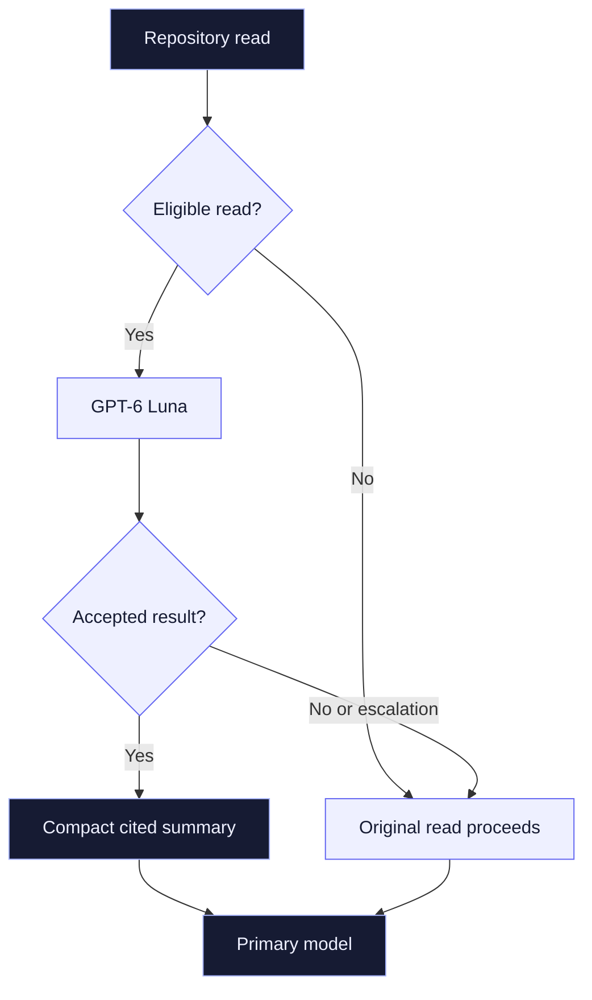
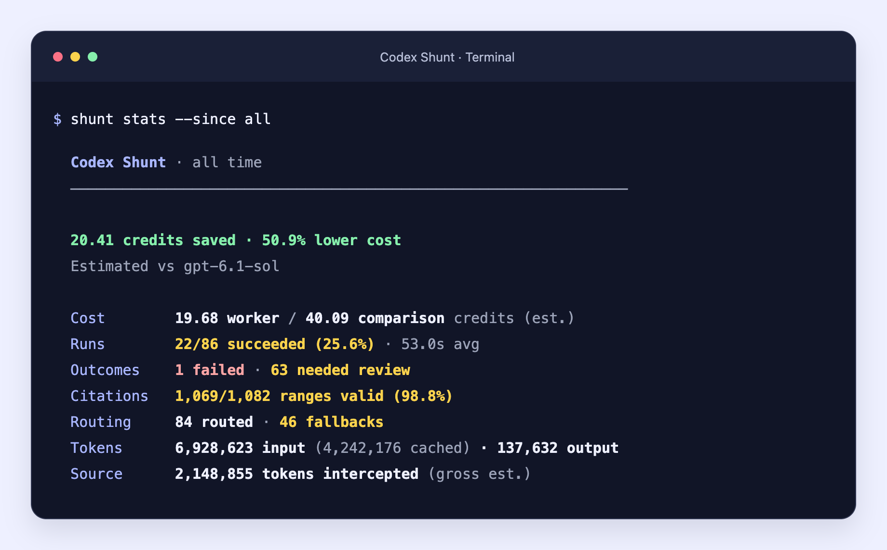

<p align="center">
  
</p>

<h1 align="center">Codex Shunt</h1>

<p align="center">
  <strong>Large reads. Compact evidence. Your primary model stays in charge.</strong>
</p>

<p align="center">
  <a href="https://github.com/OstermanEric/codex-shunt/actions/workflows/tests.yml"></a>
  
  <a href="LICENSE"></a>
</p>

<p align="center">
  <a href="#install"></a>
  <a href="#how-it-works"></a>
  <a href="#configure"></a>
  <a href="#stats"></a>
</p>

Route large repository reads to **GPT-6 Luna** using your existing ChatGPT/Codex
login. The primary model receives a compact, cited summary and keeps responsibility
for decisions and edits.

Shunt is a local Codex plugin with a Python standard-library runtime. It needs
Python 3.11+, a Codex CLI with ChatGPT authentication, and access to GPT-6 Luna.
Supported hosts are macOS, Linux, and Windows through WSL2.

## Install

Run this once in Terminal (macOS, Linux, or WSL2):

```bash
curl -fsSL https://raw.githubusercontent.com/OstermanEric/codex-shunt/main/install.sh | bash
```

The installer downloads Shunt, installs the Git marketplace plugin, creates the
`shunt` command, and starts guided setup. It adds `~/.local/bin` to your bash/zsh
startup file when needed; reopen Terminal afterward to use `shunt`.

Setup explains source sharing, checks the existing login, sends a synthetic
two-line fixture through Luna, and enables routing only after verification.
Review and trust the plugin's hook in Codex, then start a new chat. Installed
plugin users can also invoke `$codex-shunt:setup` without a Terminal command.

Shunt prefers the desktop app's bundled CLI, then searches PATH.
To choose a specific runtime, set `CODEX_SHUNT_CODEX_PATH`. If authentication is missing,
run `codex login` with ChatGPT. Shunt uses `codex exec` and removes API-key
environment variables from its worker; no separate API key is needed.

**Distribution:** this hook-based plugin uses manual/Git marketplace installation.
Lifecycle-hook packages are currently ineligible for the public Plugins Directory.
[Official packaging guidance](https://developers.openai.com/plugins/build/plugins#bundled-mcp-servers-and-lifecycle-hooks).

## How it works


```mermaid
flowchart TD
    A[Repository read] --> B{Eligible read?}
    B -->|No| F[Original read proceeds]
    B -->|Yes| C[GPT-6 Luna]
    C --> D{Accepted result?}
    D -->|Yes| E[Compact cited summary]
    D -->|No or escalation| F
    E --> G[Primary model]
    F --> G
    classDef primary fill:#161b33,color:#eef0ff,stroke:#a9b6ff
    classDef worker fill:#eef0ff,color:#161b33,stroke:#6366f1
    class A,E,G primary
    class B,C,D,F worker
```

Eligible reads use a supported command and meet the configured line or byte
threshold. Filtered files go to Luna; only a successful result with valid citation
ranges replaces the read. The primary model reviews the returned evidence.

Routing requires completed setup and source-sharing acknowledgement. If consent
or the worker runtime is unavailable, the original read proceeds. The primary
model remains responsible for verifying evidence and making edits.

## Configure

```bash
shunt config show
shunt config set min_file_lines 500
shunt config set min_source_bytes 100000
shunt config set comparison_model gpt-6.1-sol
```

You can edit `~/.local/share/codex-shunt/config.toml` directly. Partial files override
the bundled defaults:

```toml
strict_routing = true
worker_model = "gpt-6-luna"
comparison_model = "gpt-6.1-sol"
min_file_lines = 500
min_source_bytes = 100000
worker_timeout_seconds = 150
```

Routing triggers at **500 or more requested lines OR 100,000 or more requested
bytes**, by default. Thresholds apply to the supported read's text, including
bounded ranges, rather than the entire file behind every request.

Fresh installs leave routing off until setup. Use `shunt config set strict_routing
false` to disable it. Configuration also exposes source-sharing acknowledgement,
reasoning effort, and maximum source-file, source-byte, and result-size limits.
Retired compression/retention settings in older files are ignored.

## Routing

The pre-hook recognizes a deliberately small set of read-only shell commands:

- `cat` with explicit files or unquoted file globs.
- `head` / `tail` with line or byte counts, including `tail -n +N`.
- `sed -n 'N,Mp'` for one file.
- `rg` with a pattern and explicit files/globs; supported flags are
  `-n`, `-i`, `-F`, and their long forms.
- The same commands through `rtk` or `rtk proxy`.

Commands containing edits, pipelines, redirections, compound operations, shell
expansions, or unsupported flags run normally. MCP tools are not intercepted.

Selected text files are filtered and copied into a temporary workspace. Luna runs
read-only with hooks disabled and a timeout. A successful, cited result replaces
the original read; missing consent, unavailable runtime, invalid evidence, or a
worker request for escalation lets the original read proceed.

Shunt sends the selected file contents to the worker, even when the requested
operation is a range or search. The worker receives that operation as task data
and must focus its evidence accordingly. Common sensitive paths and generated
files are excluded; do not select secrets. Local telemetry stores counts and
hashes, without source text, prompts, or answers.

To inspect files explicitly:

```bash
shunt inspect --root . --question "Where is routing configured?" src
```

To obtain raw text after an unsuitable summary, retry once:

```bash
CODEX_SHUNT_BYPASS=1 cat path/to/file
```

## Stats



*Development-history snapshot, October 8, 2026, from `shunt stats --since all`.
Includes historical failures and escalations; it is not a performance benchmark
or a promise of savings.*

```bash
shunt stats --since 7d
shunt stats --since all --json
shunt stats --since 30d --compare-to gpt-6-sol
```

The terminal report leads with estimated savings, then groups cost, run health,
past outcomes, routing, and tokens in aligned rows. Green highlights savings and
healthy runs; amber/red highlight fallbacks, escalations, and failures. Narrow terminals wrap
automatically. Color is automatic in terminals; use `--color always` to force it,
or `--color never` / `NO_COLOR=1` for plain text. `--json` remains machine-readable.

“Needed review” records past escalation from Luna to the primary model. The
Outcomes row summarizes previous attempts; it does not ask the user to review
anything. Metric definitions and calculation notes are below, keeping the
terminal report concise.

The default comparison is **GPT-6.1 Sol**. Change `comparison_model` to persist a
preference, or use `--compare-to` for one report. Both reprice historical token
usage; they do not change the worker model. Supported comparison models are
listed by `shunt stats --help`.

Reports discover both Terminal and Codex plugin-data stores. Set
`CODEX_SHUNT_DATA_DIR` only to intentionally scope config and metrics to one store.

**Credits are estimates, not measured account charges or end-to-end savings.**
Source interception is a gross estimate, not net tokens saved. See the expandable
metrics reference below for definitions and calculation details.

### Inspect failed runs

```bash
shunt stats --failures --since all
shunt stats --failures --since 7d --json
```

The terminal view shows the newest 10 failed attempts with local timestamps, full
run IDs, error types, models, task kinds, duration, and token counts. Recorded
chat/turn IDs are shown when available. JSON includes every matching attempt and
all stored metadata. Setup checks and ordinary escalations are excluded; an
escalated attempt with a recorded error is included.

Telemetry keeps counts, identifiers, and hashes, so a historical failure may
have only an error type, without its detailed message, command, or source paths.
For future hook failures, start Codex with `CODEX_SHUNT_DEBUG=1` to print runtime
error details to stderr. A failed `shunt inspect` also prints its error directly.

### How metrics are calculated

<details>
<summary><strong>Metric definitions, credit formula, and accounting limits</strong></summary>

All metrics cover the selected `--since` period. Worker token counts, run counts,
and durations come from recorded runs; credits and intercepted source tokens are
estimates. Synthetic setup checks are excluded from worker metrics.

| Metric | Meaning and calculation |
| --- | --- |
| Credits saved / extra cost | Comparison cost minus worker cost. A negative result is shown as extra cost. |
| Lower / higher cost | Savings divided by comparison cost, shown as a percentage. Omitted when comparison cost is zero. |
| Cost: worker | Sum of recorded standard-rate credit estimates for all non-setup worker attempts, including failures and escalations. |
| Cost: comparison | Successful worker tokens repriced at the selected comparison model's standard rates. Failed and escalated attempts contribute no comparison cost. |
| Runs | Successful attempts divided by all non-setup worker attempts. Success requires a completed run with no recorded error or request for primary review. |
| Average time | Total recorded worker duration divided by all non-setup attempts, including failures and escalations. Displayed in seconds. |
| Outcomes: failed | Attempts with a failed status or recorded error. Inspect them with `shunt stats --failures`. |
| Outcomes: needed review | Past attempts where the worker requested escalation to the primary model, not user review. Failure and escalation counts can overlap. |
| Citations | Valid citation ranges divided by all recorded ranges. Validation checks allowed files and line bounds, not whether a claim is true. |
| Routing: routed | Hook reads replaced by accepted worker results; the original read was intercepted. |
| Routing: fallbacks | Routing attempts that allowed the original read to continue, such as missing consent, worker errors, invalid citations, or escalation. |
| Routing: observed only | Eligible reads seen while strict routing was off. No worker replacement occurred. Hidden when zero. |
| Tokens: input | Observed worker input tokens across all non-setup attempts. Includes cached input. |
| Tokens: cached | The subset of input served from cache; do not add it to input again. |
| Tokens: output | Observed worker output tokens. Reasoning tokens are a subset of output, not an extra charge. |
| Source | Gross estimated tokens intercepted by enforced hook routing: sum of `ceil(requested source bytes / 4)` for routed reads. Repeat reads count again. |
| Setup checks excluded | Number of synthetic setup runs omitted from worker metrics. Available as `setup_runs_excluded` in `--json`. |

Worker attempts and routing events are separate counts: manual inspections add
worker runs, and a routing fallback can happen before a worker starts.

Credit estimates use rates per million tokens:

```text
credits = ((input - cached) × input_rate
           + cached × cached_rate
           + output × output_rate) / 1,000,000
```

The bundled standard-rate snapshot is dated **October 8, 2026**; its date is also
available as `comparison.rate_date` in `--json`. See the
[official rates](https://learn.chatgpt.com/docs/pricing#token-rates).
Changing the comparison model reprices historical successful tokens; recorded
worker cost stays the same. All real worker costs are subtracted from comparison
cost, so failed and escalated work reduces estimated savings.

**Credits are estimates, not measured account charges, subscription-allowance
reductions, or end-to-end savings.** Gross source interception does not subtract
replacement summaries, verification, or retries, so it is not net tokens saved.

</details>

## Development

```bash
python3 -m unittest discover -s tests -v
python3 -m compileall -q src
```

After updating an installed plugin, reinstall/refresh it and start a new chat.
Changed hook definitions require another trust review. Removed commands from
0.1 are `summarize-log`, `report`, `export`, `feedback`, and `data-dir`; use
`inspect`, `stats --json`, and `config show`. Existing metrics remain readable.

For troubleshooting, run `shunt status` or set `CODEX_SHUNT_DEBUG=1` to explain
hook fallbacks. Native PowerShell, web ChatGPT, and cloud orchestration cannot
run this local hook/worker flow.

Licensed under [MIT](LICENSE).
